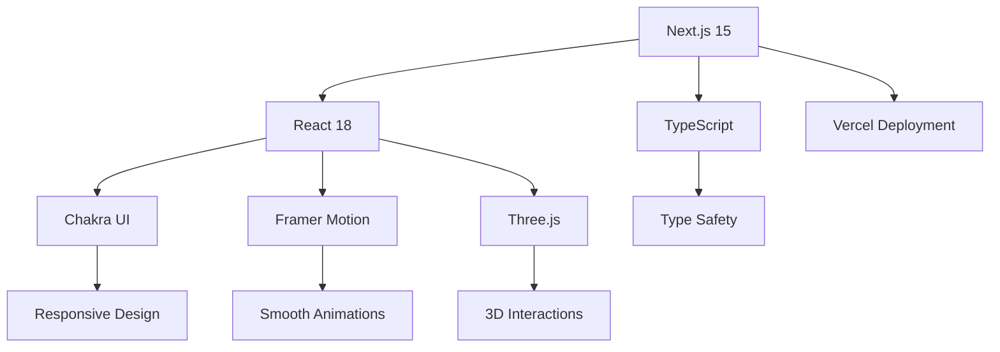

# Tech Stack 🛠️

> Comprehensive overview of technologies, libraries, and tools used in Tony's Portfolio

## 🏗️ Architecture Overview

This project is built using modern web technologies with a focus on performance, developer experience, and user engagement. The stack is carefully chosen to provide the best balance of functionality, maintainability, and performance.



## 🎯 Core Technologies

### Frontend Framework

#### **Next.js 15** 🚀

- **Purpose**: React framework with SSR, SSG, and optimization
- **Version**: `^15.0.0`
- **Key Features**:
  - Server-Side Rendering (SSR)
  - Static Site Generation (SSG)
  - Automatic code splitting
  - Image optimization
  - Built-in CSS support
  - API routes

```javascript
// next.config.js example
module.exports = {
  images: {
    domains: ['example.com'],
    formats: ['image/webp', 'image/avif'],
  },
  experimental: {
    optimizeCss: true,
  },
};
```

#### **React 18** ⚛️

- **Purpose**: UI library for building interactive interfaces
- **Version**: `^18.0.0`
- **Key Features**:
  - Concurrent rendering
  - Automatic batching
  - Suspense improvements
  - React Server Components

#### **TypeScript** 📝

- **Purpose**: Type-safe JavaScript development
- **Version**: `^5.0.0`
- **Benefits**:
  - Compile-time error checking
  - Better IDE support
  - Improved code documentation
  - Refactoring safety

```typescript
// Example TypeScript interface
interface ProjectData {
  id: string;
  title: string;
  stack: string[];
  description: string;
  features: string[];
  liveUrl: string | null;
  githubUrl: string | null;
  color: string;
  result: string;
}
```

## 🎨 UI & Styling

### **Chakra UI** 🎭

- **Purpose**: Modular and accessible component library
- **Version**: `^2.8.0`
- **Key Features**:
  - Built-in dark mode support
  - Responsive design utilities
  - Accessibility-first components
  - Customizable theme system
  - TypeScript support

```javascript
// Theme customization example
const theme = extendTheme({
  colors: {
    brand: {
      50: '#f7fafc',
      500: '#38b2ac',
      900: '#1a202c',
    },
  },
  fonts: {
    heading: 'Inter, sans-serif',
    body: 'Inter, sans-serif',
  },
});
```

### **Framer Motion** 🎬

- **Purpose**: Production-ready motion library for React
- **Version**: `^10.0.0`
- **Features**:
  - Declarative animations
  - Gesture recognition
  - Scroll-triggered animations
  - Layout animations
  - SVG path animations

```javascript
// Animation example
const variants = {
  hidden: { opacity: 0, y: 20 },
  visible: { opacity: 1, y: 0 },
};

<motion.div
  variants={variants}
  initial='hidden'
  animate='visible'
  transition={{ duration: 0.6 }}
>
  Content
</motion.div>;
```

## 🎮 3D Graphics & Interactions

### **Three.js** 🎯

- **Purpose**: WebGL 3D library for interactive models
- **Version**: `^0.155.0`
- **Implementation**: Custom 3D dog model with orbit controls
- **Features**:
  - WebGL rendering
  - 3D model loading (GLB/GLTF)
  - Interactive controls
  - Responsive sizing
  - Performance optimization

```javascript
// Three.js setup example
const scene = new THREE.Scene();
const camera = new THREE.PerspectiveCamera(
  75,
  window.innerWidth / window.innerHeight,
  0.1,
  1000
);
const renderer = new THREE.WebGLRenderer({ antialias: true, alpha: true });

// Load 3D model
const loader = new GLTFLoader();
loader.load('/dog.glb', gltf => {
  scene.add(gltf.scene);
});
```

### **React Three Fiber** (Optional Enhancement)

- **Purpose**: React renderer for Three.js
- **Benefits**: Declarative 3D scenes with React components
- **Future Enhancement**: Could replace vanilla Three.js implementation

## 🎨 Icons & Assets

### **React Icons** 🎨

- **Purpose**: Popular icon libraries as React components
- **Version**: `^4.11.0`
- **Included Libraries**:
  - Ionicons (`IoLogoGithub`, `IoLogoInstagram`)
  - Feather Icons
  - Font Awesome
  - Material Design Icons

```javascript
// Icon usage example
import { IoLogoGithub, IoLogoInstagram } from 'react-icons/io5';

<Icon as={IoLogoGithub} boxSize={6} />;
```

### **Next.js Image** 🖼️

- **Purpose**: Optimized image loading and rendering
- **Features**:
  - Automatic WebP/AVIF conversion
  - Lazy loading
  - Responsive images
  - Blur placeholder

```javascript
// Optimized image example
<Image
  src='/images/project.jpg'
  alt='Project screenshot'
  width={600}
  height={400}
  placeholder='blur'
  blurDataURL='data:image/jpeg;base64,...'
/>
```

## 📱 Progressive Web App (PWA)

### **Service Worker** 🔧

- **Purpose**: Offline functionality and caching
- **Implementation**: Custom service worker for asset caching
- **Features**:
  - Offline page access
  - Asset caching
  - Background sync
  - Push notifications (future)

### **Web App Manifest** 📱

- **Purpose**: Native app-like experience
- **File**: `public/manifest.json`
- **Features**:
  - Install prompt
  - Splash screen
  - App icons
  - Theme colors

```json
{
  "name": "Tony's Portfolio",
  "short_name": "Portfolio",
  "description": "Tony Yam's Portfolio Website",
  "start_url": "/",
  "display": "standalone",
  "background_color": "#ffffff",
  "theme_color": "#38b2ac",
  "icons": [
    {
      "src": "/icons/icon-192x192.png",
      "sizes": "192x192",
      "type": "image/png"
    }
  ]
}
```

## 🔧 Development Tools

### **ESLint** 📋

- **Purpose**: Code linting and quality enforcement
- **Version**: `^8.0.0`
- **Configuration**: Next.js recommended rules + custom rules
- **Rules**: TypeScript, React hooks, accessibility

```json
{
  "extends": ["next/core-web-vitals", "@typescript-eslint/recommended"],
  "rules": {
    "@typescript-eslint/no-unused-vars": "error",
    "react-hooks/exhaustive-deps": "warn"
  }
}
```

### **Prettier** 💅

- **Purpose**: Code formatting and style consistency
- **Version**: `^3.0.0`
- **Configuration**: Consistent formatting across the team

```json
{
  "semi": true,
  "trailingComma": "es5",
  "singleQuote": true,
  "printWidth": 80,
  "tabWidth": 2
}
```

### **Husky** 🐕

- **Purpose**: Git hooks for code quality
- **Features**:
  - Pre-commit linting
  - Pre-push testing
  - Commit message validation

## 🚀 Deployment & Hosting

### **Vercel** ⚡

- **Purpose**: Optimized hosting for Next.js applications
- **Features**:
  - Automatic deployments
  - Edge functions
  - Image optimization
  - Analytics
  - Preview deployments

### **GitHub Actions** 🔄

- **Purpose**: CI/CD pipeline automation
- **Workflows**:
  - Type checking
  - Linting
  - Build testing
  - Automated deployment

```yaml
# .github/workflows/ci.yml
name: CI/CD Pipeline
on: [push, pull_request]
jobs:
  test:
    runs-on: ubuntu-latest
    steps:
      - uses: actions/checkout@v3
      - uses: actions/setup-node@v3
      - run: npm ci
      - run: npm run type-check
      - run: npm run lint
      - run: npm run build
```

## 📊 Performance & Analytics

### **Core Web Vitals** 📈

- **Monitoring**: Built-in Next.js performance monitoring
- **Metrics**: LCP, FID, CLS tracking
- **Optimization**: Image optimization, code splitting

### **Bundle Analysis** 📦

- **Tool**: `@next/bundle-analyzer`
- **Purpose**: Analyze bundle size and dependencies
- **Usage**: `npm run analyze`

## 🔒 Security & Best Practices

### **Content Security Policy** 🛡️

- **Implementation**: Next.js security headers
- **Protection**: XSS, clickjacking, code injection

### **Environment Variables** 🔐

- **Management**: `.env.local` for sensitive data
- **Security**: No secrets in client-side code
- **Validation**: Runtime environment validation

## 📦 Package Management

### **npm** 📋

- **Version**: 8.0+
- **Lock File**: `package-lock.json` for consistent installs
- **Scripts**: Custom scripts for development workflow

### **Dependencies Overview**

| Category        | Package          | Version  | Purpose           |
| --------------- | ---------------- | -------- | ----------------- |
| **Framework**   | next             | ^15.0.0  | React framework   |
| **UI Library**  | @chakra-ui/react | ^2.8.0   | Component library |
| **Animations**  | framer-motion    | ^10.0.0  | Motion library    |
| **3D Graphics** | three            | ^0.155.0 | WebGL library     |
| **Icons**       | react-icons      | ^4.11.0  | Icon components   |
| **Language**    | typescript       | ^5.0.0   | Type safety       |
| **Linting**     | eslint           | ^8.0.0   | Code quality      |
| **Formatting**  | prettier         | ^3.0.0   | Code formatting   |

## 🔄 Version Management

### **Semantic Versioning** 📌

- **Major**: Breaking changes
- **Minor**: New features
- **Patch**: Bug fixes

### **Dependency Updates** 🔄

- **Strategy**: Regular updates with testing
- **Tools**: Dependabot for automated PRs
- **Testing**: Full CI/CD pipeline before merging

## 🎯 Performance Optimizations

### **Code Splitting** ✂️

```javascript
// Dynamic imports for heavy components
const VoxelDog = dynamic(() => import('../components/voxel-dog'), {
  ssr: false,
  loading: () => <Box h='400px' w='100%' bg='transparent' />,
});
```

### **Image Optimization** 🖼️

- **Format**: WebP/AVIF with fallbacks
- **Sizing**: Responsive images
- **Loading**: Lazy loading with blur placeholders

### **Bundle Optimization** 📦

- **Tree Shaking**: Automatic dead code elimination
- **Minification**: Production build optimization
- **Compression**: Gzip/Brotli compression

## 🔮 Future Enhancements

### **Planned Upgrades** 🚀

- **React 19**: When stable release is available
- **Next.js 16**: Latest features and optimizations
- **Three.js R3F**: Migration to React Three Fiber
- **Storybook**: Component documentation
- **Testing**: Jest + React Testing Library

### **Performance Goals** 📊

- **Lighthouse Score**: 95+ across all metrics
- **Bundle Size**: <500KB initial load
- **Load Time**: <2s on 3G networks
- **Accessibility**: WCAG 2.1 AA compliance

---

**Next Steps**: Explore the [Customization Guide](Customization-Guide) to learn how to modify and extend the tech stack, or check out the [Performance Optimization](Performance-Optimization) guide for advanced techniques.
